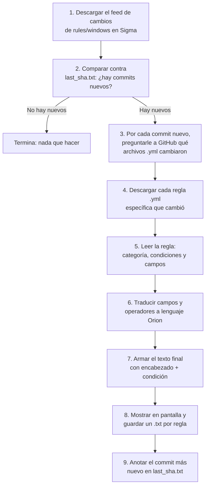

```
██        █████  ███████
██       ██   ██ ██     
██       ███████ ███████
██       ██   ██      ██
███████  ██   ██ ███████

███    ███  █████  ██      ██    ██ ███████ ███    ██  █████  ███████
████  ████ ██   ██ ██      ██    ██   ██    ████   ██ ██   ██ ██     
██ ████ ██ ███████ ██      ██    ██   ██    ██ ██  ██ ███████ ███████
██  ██  ██ ██   ██ ██       ██  ██    ██    ██  ██ ██ ██   ██      ██
██      ██ ██   ██ ███████   ████   ███████ ██   ████ ██   ██ ███████

               ███████  ██████  ███    ██
               ██      ██    ██ ████   ██
               ███████ ██    ██ ██ ██  ██
                    ██ ██    ██ ██  ██ ██
               ███████  ██████  ██   ████

 █████  ██████   ██████  ███████ ███    ██ ████████ ███████ ███    ██  █████  ███████
██   ██ ██   ██ ██       ██      ████   ██    ██       ██   ████   ██ ██   ██ ██     
███████ ██████  ██   ███ █████   ██ ██  ██    ██       ██   ██ ██  ██ ███████ ███████
██   ██ ██   ██ ██    ██ ██      ██  ██ ██    ██       ██   ██  ██ ██ ██   ██      ██
██   ██ ██   ██  ██████  ███████ ██   ████    ██    ███████ ██   ████ ██   ██ ███████
```

# ¿Qué hace `sigma2orion.py`? (Guía para no programadores)

## En una frase
El script vigila el repositorio público de reglas de detección **Sigma** (proyecto SigmaHQ), detecta cuándo se agregan o modifican reglas para Windows, y **traduce automáticamente** esas reglas al formato que entiende la plataforma **Orion** (el EDR/antivirus), dejando el resultado listo para copiar y pegar.

No necesita que nadie escriba la regla a mano: Sigma es un "idioma" genérico para describir amenazas, y Orion tiene su propio "idioma" (campos y operadores distintos). Este script es el traductor entre los dos.

---

## Los archivos que intervienen

| Archivo | Para qué sirve |
|---|---|
| `sigma2orion.py` | Version **a demanda**: hace una sola revision de reglas nuevas y termina. Para correrlo manualmente o dispararlo desde un cron externo. |
| `sigma2orion_service.py` | Version **servicio**: queda corriendo indefinidamente, revisando cada cierto tiempo (configurable). Para dejarlo como agente en segundo plano. |
| `sigma2orion_core.py` | El motor con toda la logica de traduccion (descarga de Sigma, mapeo de campos, generacion de reglas Orion, logging, estadisticas). Los dos scripts de arriba lo usan; no se ejecuta directamente. |
| `sigma2orion.service` | Archivo de ejemplo para registrar `sigma2orion_service.py` como servicio de `systemd` en Linux, para que arranque solo y se reinicie si falla. |
| `orion.txt` | El "diccionario de referencia": muestra qué campos y operadores existen en Orion para cada tipo de evento (`ProcessOps`, `NetworkOps`, `DnsOps`, etc.) y el formato exacto del encabezado que Orion espera. El programador lo usó como base para armar las tablas de traducción dentro del código; el script **no lo lee en cada ejecución**, ya está "copiado" dentro del código. |
| `last_sha.txt` | Una libreta de un solo renglón donde el script anota el último cambio (commit) de Sigma que ya procesó. Así, la próxima vez que se ejecute, no vuelve a mirar cambios viejos. |
| `windows.atom` | Es una copia de ejemplo del feed de cambios de GitHub que quedó guardada en la carpeta. El script **no usa este archivo**: en cada ejecución baja la versión más actual directamente desde GitHub por internet. |
| `orion_rules.txt` | El archivo de **salida**. Cada vez que el script procesa una regla, le agrega un nuevo bloque al final (no borra lo anterior). Es el archivo que el operador debe abrir para copiar las reglas listas para Orion. |
| `sigma2orion.log` | **Log de funcionamiento**. Registro detallado de cada paso de cada corrida: qué commit se procesó, qué regla se creó, qué campos se ignoraron por no tener equivalencia Sigma → Orion, y qué errores de red (timeouts, sin conexión) ocurrieron. Se va agregando en cada ejecución. |
| `rules_stats.jsonl` | Una línea por cada regla procesada (formato JSON), con fecha, commit, archivo y resultado (`created`, `discarded_fp`, `no_orion_type` o `error`). Es la base de datos que usa `stats.py` para armar las estadísticas. |
| `stats.py` | Script aparte que lee `rules_stats.jsonl` y muestra cuántas reglas se crearon por mes y por año. |
| `.env` | Archivo local (no se sube al repo) donde se guarda la clave real de VirusTotal (`VT_API_KEY`) y el intervalo de revisión (`CHECK_INTERVAL_MINUTES`). |
| `.env_ejemplo` | Versión de ejemplo de `.env`, sin clave real, para saber qué variables hay que completar. |

---

## Dos formas de correrlo

### A demanda (`sigma2orion.py`)

Hace una sola revisión de reglas nuevas y termina. Es la forma más simple, ideal para probar a mano o para dispararlo desde un cron/tarea programada externa:

```bash
python3 sigma2orion.py
```

### Como servicio continuo (`sigma2orion_service.py`)

Queda corriendo indefinidamente: revisa una vez, espera el intervalo configurado y vuelve a revisar, sin necesidad de cron.

```bash
python3 sigma2orion_service.py
```

- El intervalo de espera entre revisiones se configura con `CHECK_INTERVAL_MINUTES` en el `.env` (por defecto 60 minutos si no está definida o tiene un valor inválido).
- Se detiene de forma prolija al recibir `Ctrl+C` o una señal `SIGTERM` (por ejemplo, al hacer `systemctl stop`): termina la corrida en curso y no arranca una nueva.
- Si una corrida falla por un error inesperado, se registra en `sigma2orion.log` y el bucle sigue en el próximo ciclo (el servicio no se cae).

### Dejarlo como servicio de systemd (Linux)

1. Copiar `sigma2orion.service` a `/etc/systemd/system/sigma2orion.service` y editar `WorkingDirectory`, `ExecStart` y `User` con la ruta y el usuario reales.
2. Habilitarlo y arrancarlo:
   ```bash
   sudo systemctl daemon-reload
   sudo systemctl enable --now sigma2orion.service
   ```
3. Ver el estado y los logs:
   ```bash
   systemctl status sigma2orion.service
   journalctl -u sigma2orion.service -f
   ```

---

## Manejo de errores de red

Toda descarga desde GitHub o VirusTotal pasa por `http_get`, que ahora:
- Espera como máximo 20 segundos por respuesta (timeout) antes de darla por perdida.
- Si falla (sin conexión, timeout, error del servidor), reintenta hasta 3 veces con una pausa creciente entre intentos.
- Si después de los 3 intentos sigue sin poder conectar, registra el error en `sigma2orion.log` y **omite ese commit o esa regla** en vez de cortar toda la ejecución (salvo que falle la primera consulta al feed de commits, en cuyo caso el script termina porque no tiene nada para procesar).

## Log de funcionamiento

Cada corrida queda registrada en `sigma2orion.log` (y también se imprime en pantalla), con una línea por paso importante: commit en proceso, regla creada, regla descartada por riesgo de falso positivo, categoría sin equivalente en Orion, y **cada campo Sigma que se ignoró por no tener mapeo a un campo de Orion**.

## Estadísticas de uso

Para ver cuántas reglas se generaron por mes y por año:

```bash
python3 stats.py            # solo reglas creadas, por mes y por año
python3 stats.py --all      # incluye también descartadas, sin tipo y con error
python3 stats.py --year 2026
```

---

## El recorrido paso a paso



### 1. Descargar la lista de cambios de Sigma
El script pide a GitHub la página de "historial de cambios" (`windows.atom`) de la carpeta `rules/windows` del repositorio Sigma. De ahí saca la lista de identificadores de commits (los "hash", como una huella digital de cada cambio), ordenados del más nuevo al más viejo.

### 2. Ver qué es nuevo desde la última vez
Abre `last_sha.txt` y busca ese identificador dentro de la lista que acaba de bajar:
- Si es la **primera vez** que se corre (no existe el archivo), sólo toma el commit más reciente.
- Si encuentra el identificador guardado, toma **todos los commits posteriores** a ese (los que faltan procesar).
- Si el identificador guardado ya **no aparece** en la lista (por ejemplo, pasó demasiado tiempo desde la última corrida), toma sólo el más reciente para no quedarse atascado.
- Si no hay commits nuevos, el script avisa "No hay commits nuevos" y termina.

### 3. Preguntar qué archivos cambiaron en cada commit
Para cada commit pendiente, le pregunta a la API de GitHub el detalle de ese cambio, y se queda únicamente con los archivos que:
- fueron **agregados o modificados** (no le interesan los eliminados), y
- están dentro de la carpeta `rules/windows/`, y
- terminan en `.yml` (son reglas Sigma).

### 4. Descargar cada regla puntual
Por cada archivo `.yml` detectado, lo descarga directamente desde `raw.githubusercontent.com` usando el identificador del commit — así se asegura de traer exactamente la versión de ese momento.

### 5. Leer la regla Sigma
Cada regla Sigma es un archivo de texto (YAML) con esta información relevante:
- **`logsource.category`**: qué tipo de evento describe la regla (por ejemplo "se ejecutó un proceso", "se modificó el registro de Windows", "hubo una conexión de red", "se hizo una consulta DNS", etc.).
- **`detection`**: uno o varios grupos de condiciones (llamados `selection_algo`), cada uno con campos y valores a buscar (por ejemplo: "el programa ejecutado se llama tal cosa" o "la línea de comando contiene tal palabra").
- **`detection.condition`**: la fórmula que combina esos grupos con `and`/`or`/`not`, o expresiones como `1 of selection_*` (que significa "que se cumpla al menos uno de todos los grupos que empiezan con selection_").

### 6. Traducir todo a lenguaje Orion
- La **categoría** Sigma (ej. `process_creation`) se traduce a un **Tipo de evento Orion** (ej. `ProcessOps`). Si la categoría no tiene equivalente conocido, la regla se marca como "no se puede cargar directo" y se avisa.
- Cada **campo** Sigma dentro de las condiciones (ej. `Image`, `CommandLine`, `TargetObject`) se traduce al campo Orion correspondiente (ej. `ChildPath`, `CommandLine`, `Key`). **Si un campo no tiene equivalente en Orion, esa línea se descarta** (no se inventa nada).
- Cada **modificador** Sigma (ej. `|contains`, `|endswith`, `|startswith`, `|re`) se traduce al operador Orion (`containsAny`, `endsWithAny`, `startsWithAny`, `matches`). Si no hay modificador, se usa `equals`.
- La **fórmula de condición** (`1 of selection_*`, `all of selection_*`, `selection_a and not selection_b`, etc.) se "despliega": se reemplazan los nombres de grupo por sus condiciones reales, y se genera una lista de líneas planas separadas por `AND`, `OR` o `NOT`, lista para leer de arriba a abajo.

### 7 y 8. Armar el resultado final y guardarlo
Para cada regla arma un texto con:
- Un **ID numérico de 8 dígitos** (por ejemplo `04821573`) y la **fecha y hora exacta** en que se generó ese bloque, para que el operador sepa fácilmente cuál es cuál y cuándo se creó.
- Un **encabezado fijo** (Nombre, Descripción, Dueño = Telefónica Móviles Argentina, Riesgo, técnica MITRE ATT&CK asociada, Clientes, Sistema operativo, etc.)
- El **Tipo de Orion** detectado.
- Las **condiciones ya traducidas**, línea por línea.

Ese texto **ya no se muestra por consola**: se agrega al final del archivo `orion_rules.txt` (si no existe, se crea). Así, con el tiempo, ese archivo va acumulando el historial completo de todas las reglas procesadas, cada una identificable por su ID y su fecha/hora.

**Filtros de seguridad/calidad antes de publicar una regla:**
- Si la regla Sigma original está marcada como `experimental`, `test`, `unsupported` o `deprecated`, o si tiene "falsos positivos" conocidos relevantes documentados, el script **descarta la regla completa** y sólo avisa el motivo, para evitar generar alertas ruidosas o poco confiables.
- Para reglas que buscan dominios de internet (DNS), el script puede opcionalmente consultar **VirusTotal** para ver si el antivirus "Panda" ya detecta ese dominio como malicioso. Si es así, omite ese dominio puntual de la condición (porque ya está cubierto por otra capa de protección). *Esta consulta a VirusTotal sólo se activa si se configura una clave de API válida en la variable de entorno `VT_API_KEY`; si no hay clave configurada, este paso simplemente se salta.*

### 9. Recordar hasta dónde llegó
Al terminar de procesar todos los commits pendientes, guarda en `last_sha.txt` el identificador del commit más reciente. La próxima corrida arrancará justo después de ahí.

---

## Resultado que se obtiene
Por cada regla nueva de Windows que Sigma publique y que sea traducible, se agrega un bloque de texto como este al final de `orion_rules.txt` (ejemplo simplificado):

```
ID: 04821573 | Generado: 2026-08-05 12:40:11
Name: ARCustomNombreDeLaRegla
Description: ...
Owner:Nic0 Echandi
...
Type: ProcessOps
Datos de Condition:
  CommandLine (containsAny) powershell -enc
  OR
  ChildPath (endsWithAny) \powershell.exe
```

Ese texto se puede copiar directamente en la consola de Orion para crear la alerta. Si una regla se descarta (por riesgo de falsos positivos o por no tener `Type` equivalente), también queda registrado en `orion_rules.txt` con su propio ID, fecha/hora y el motivo del descarte, en lugar de perderse en la consola.

---

## Limitaciones a tener en cuenta
- Si la categoría de la regla Sigma no está en la tabla de traducción interna, la regla **no se puede cargar** y sólo se informa el motivo.
- Si un campo específico de una regla no tiene equivalente en Orion, esa condición puntual **se pierde** (no rompe el resto de la regla, pero puede hacer la regla menos precisa).
- El script depende de tener acceso a internet para descargar el feed de GitHub y las reglas.
- Se corrigió un problema de seguridad: la clave de VirusTotal estaba escrita por error directamente en el código. Ahora se lee desde un archivo `.env` (que **no** se sube al repositorio) con la variable `VT_API_KEY=tu_clave`. El archivo `.env_ejemplo` muestra qué variable hay que completar, sin exponer ninguna clave real; conviene copiarlo como `.env` y completar el valor propio.
- El archivo `orion_rules.txt` crece indefinidamente (nunca se borra ni se sobrescribe): conviene revisarlo y archivarlo/limpiarlo periódicamente para que no se vuelva muy grande.
